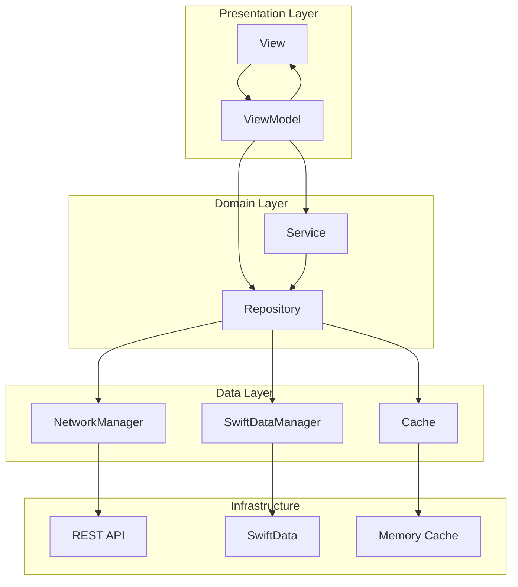

# 📱 CaptureCat - 나만의 스크린샷 조력자
## 🚀 서비스 소개
“오늘은 어떤 정보를 캡처하셨나요?”

우리는 하루에도 수많은 정보를 캡처하지만, 갤러리 속에서 금세 잊히곤 합니다.
캡처캣은 스크린샷을 단순한 이미지가 아닌, 다시 활용 가능한 정보로 바꿔주는 조력자입니다.

이런 분께 추천해요
- 갤러리에 다양한 정보가 있지만 정리하기 막막한 분
- 나중에 다시 보고 싶은데 지우긴 아까운 분
- 필요할 때 찾지 못해 시간을 낭비한 경험이 있는 분

### 주요 기능
- **스크린샷 자동 수집**: Photos 라이브러리에서 스크린샷만 자동으로 필터링하여 수집
- **태그 기반 분류**: 스크린샷에 태그를 추가하여 카테고리별로 체계적 관리
- **즐겨찾기 기능**: 중요한 스크린샷을 즐겨찾기로 표시하여 빠른 접근
- **검색 기능**: 태그 기반 검색으로 원하는 스크린샷을 빠르게 탐색
- **임시보관함**: 정리 전 스크린샷들을 임시로 보관하는 공간
- **소셜 로그인**: 카카오 로그인을 통한 간편한 회원가입 및 동기화
- **서버 동기화**: 로그인 시 스크린샷과 태그 정보를 서버와 동기화

## 🛠 사용 기술

### 프레임워크 & 언어
- **Swift 5.0**
- **SwiftUI** - 모던한 UI 프레임워크
- **SwiftData** - 로컬 데이터 관리
- **Photos Framework** - 사진 라이브러리 접근
- **URLSession** - 네트워크 통신

### 주요 라이브러리
```
• KakaoSDKAuth, KakaoSDKCommon, KakaoSDKUser (2.24.5) - 카카오 소셜 로그인
• Mixpanel (master branch) - 사용자 행동 분석
• SwiftLint (0.59.1) - 코드 품질 관리
• CryptoSwift (1.8.4) - 암호화 기능
• CollectionConcurrencyKit (0.2.0) - 컬렉션 동시성 처리
```

### 개발 환경
- **iOS Deployment Target**: 17.6+
- **Xcode**: 최신 버전
- **아키텍처**: Clean Architecture + MVVM

## 🏗 프로젝트 구조

```
CaptureCat/
├── App/                          # 앱 진입점 및 설정
│   └── CaptureCatApp.swift
├── Data/                         # 데이터 레이어
│   ├── Network/                  # 네트워크 관련
│   │   ├── Manager/              # NetworkManager, TokenManager
│   │   ├── Builder/              # API 빌더 패턴
│   │   ├── Model/                # DTO 모델
│   │   ├── Serializer/           # 직렬화/역직렬화
│   │   └── Storage/              # 로컬 스토리지 (UserDefaults, Keychain)
│   └── Persistence/              # 로컬 데이터베이스
│       ├── SwiftDataManager.swift
│       └── Screenshot.swift
├── Domain/                       # 도메인 레이어
│   ├── Repositories/             # 데이터 저장소 추상화
│   └── Service/                  # 비즈니스 로직
│       ├── AuthService.swift
│       ├── ImageService.swift
│       ├── TagService.swift
│       ├── SyncService.swift
│       └── ScreenshotManager.swift
├── Presentation/                 # 프레젠테이션 레이어
│   ├── Scenes/                   # 화면별 View & ViewModel
│   │   ├── Auth/                 # 로그인 관련
│   │   ├── Home/                 # 홈 화면
│   │   ├── Storage/              # 임시보관함
│   │   ├── Search/               # 검색 화면
│   │   ├── Tag/                  # 태그 편집
│   │   ├── Detail/               # 상세 화면
│   │   ├── Favorite/             # 즐겨찾기
│   │   └── Navigation/           # 네비게이션 및 탭
│   └── ViewModels/               # 공용 ViewModel
├── DesignSystem/                 # 디자인 시스템
│   ├── Component/                # 재사용 UI 컴포넌트
│   ├── Color/                    # 컬러 시스템
│   └── Font/                     # 폰트 시스템
└── Util/                         # 유틸리티
    ├── PhotoLoader.swift         # 이미지 로딩 & 캐싱
    ├── Extension/                # Swift 확장
    └── KeyChain/                 # 키체인 관리
```

## 🏛 아키텍처

### Clean Architecture + MVVM



### 핵심 패턴

#### 1. Repository Pattern
```swift
// 로그인 상태에 따라 로컬/서버 데이터 소스를 자동 분기
func loadAll() throws -> [ScreenshotItemViewModel] {
    if AccountStorage.shared.isGuest ?? true {
        return try loadFromLocal()  // SwiftData 사용
    } else {
        return InMemoryScreenshotCache.shared.retrieveAll()  // 메모리 캐시 사용
    }
}
```

#### 2. Builder Pattern (Network)
```swift
protocol BuilderProtocol {
    associatedtype Response: Codable
    var path: String { get }
    var method: HTTPMethod { get }
    var headers: [String: String] { get }
    var parameters: [String: Any] { get }
}
```

#### 3. Actor Pattern (동시성 제어)
```swift
actor TokenManager {
    private var currentRefreshTask: Task<Bool, Never>?
    
    func ensureValidToken() async -> Bool {
        // 동시 토큰 갱신 방지
    }
}
```

## 🔥 핵심 트러블슈팅

### 1. 메모리 관리 최적화

**문제**: 대용량 스크린샷 로딩 시 메모리 사용량 급증

**해결책**:
```swift
// PhotoLoader.swift - 계층적 캐싱 전략
private let cache = NSCache<NSString, UIImage>()  // 메모리 캐시
private let urlCache: URLCache                    // 디스크 캐시

// 메모리 제한 설정
cache.totalCostLimit = 200 * 1024 * 1024  // 200MB
cache.countLimit = 500  // 최대 500개

// 앱 라이프사이클 기반 캐시 관리
private func handleMemoryWarning() {
    PhotoLoader.shared.clearAllLocalImageCache()  // 메모리 캐시만 정리
    // 디스크 캐시는 유지하여 사용자 경험 보존
}
```

### 2. 동시성 제어 및 토큰 갱신

**문제**: 여러 API 호출 시 동시 토큰 갱신으로 인한 충돌

**해결책**:
```swift
// TokenManager.swift - Actor 패턴으로 동시성 제어
actor TokenManager {
    private var currentRefreshTask: Task<Bool, Never>?
    
    func ensureValidToken() async -> Bool {
        // 진행 중인 갱신이 있으면 그 결과를 기다림
        if let ongoingTask = currentRefreshTask {
            return await ongoingTask.value
        }
        
        // 새로운 갱신 작업 시작 (단일 실행 보장)
        let refreshTask = Task<Bool, Never> {
            await performTokenRefresh()
        }
        currentRefreshTask = refreshTask
        
        let result = await refreshTask.value
        currentRefreshTask = nil
        return result
    }
}
```

### 3. 배치 업로드 성능 최적화

**문제**: 대량 스크린샷 업로드 시 서버 부하 및 타임아웃

**해결책**:
```swift
// SyncService.swift - 배치 처리 및 재시도 로직
private let batchSize = 5        // 배치 크기 제한
private let maxRetries = 3       // 재시도 횟수

func syncLocalScreenshotsToServer() async -> SyncResult {
    let batches = screenshots.chunked(into: batchSize)
    
    for (batchIndex, batch) in batches.enumerated() {
        let result = await processBatch(batch)
        
        // 배치 간 대기로 서버 부하 방지
        try? await Task.sleep(nanoseconds: 500_000_000)  // 0.5초
    }
}

// 개별 배치 처리 시 재시도 로직
private func processBatch(_ screenshots: [Screenshot]) async -> BatchResult {
    for attempt in 1...maxRetries {
        do {
            return try await uploadBatch(screenshots)
        } catch {
            if attempt == maxRetries { throw error }
            // 지수 백오프로 재시도 간격 증가
            try? await Task.sleep(nanoseconds: UInt64(pow(2.0, Double(attempt)) * 1_000_000_000))
        }
    }
}
```

## 🔍 주요 특징

- **이중 데이터 소스**: 게스트 모드(SwiftData) / 로그인 모드(서버 + 메모리 캐시)
- **프리페칭**: 이미지 프리로딩으로 스크롤 성능 최적화
- **메모리 관리**: Scene Phase 기반 자동 캐시 정리
- **에러 핸들링**: 네트워크 에러별 세분화된 처리
- **사용자 분석**: Mixpanel을 통한 사용 패턴 추적

---

last updated version 1.0.1
